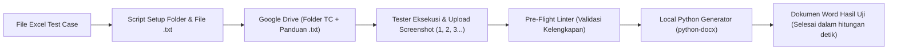

---
tags:
  - QA
  - HasilUji
  - Python
  - GDrive
  - Automation
  - BestPractice
date: 2026-09-23
---
# 📑 02 - Arsitektur Otomasi Dokumen Hasil Uji (Google Drive & Python Generator)

Catatan ini mendokumentasikan arsitektur dan *best practice* penyusunan **Dokumen Hasil Uji (SIT/UAT Report)** otomatis menggunakan integrasi **Google Drive for Desktop**, **Script Python (`python-docx`)**, dan **AI sebagai Script Architect**.

---

## 1. Filosofi & Keunggulan Alur Kerja

Struktur alur kerja ini dirancang dengan pendekatan **Human-Centered QA (Tester Experience)** dan **Context Engineering**:



### Mengapa Alur Ini Sangat Efisien?
1. **Mengurangi *Cognitive Load* Tester:** Anggota tim tidak perlu bolak-balik membuka file Excel berisi ratusan baris. Cukup buka folder TC (misal: `4.4 Membuka halaman user/`), baca panduan langkah di file `.txt`, jalankan pengujian, lalu simpan tangkapan layar.
2. **Kerapian Otomatis:** Urutan screenshot dikunci dengan penamaan angka `1.png`, `2.png`, `3.png`, sehingga gambar masuk ke tabel Word dalam urutan yang tepat tanpa perlu diatur manual.
3. **Pemisahan Peran yang Jelas:** Manusia fokus menguji dan mengambil bukti otentik, sedangkan script bertugas melakukan tugas repetitif menyusun layout dokumen.

---

## 2. Perbedaan Krusial: Chat AI Web vs Script Python Lokal

Sering terjadi kesalahpahaman dalam pemanfaatan AI untuk pembuatan dokumen laporan:

| Aspek | Cara Kurang Tepat (Upload Gambar ke Chat AI) | Cara Best Practice (Script Python Lokal) |
| :--- | :--- | :--- |
| **Media Eksekusi** | Browser web (ChatGPT / Claude / Gemini Web). | Terminal lokal laptop (`python generate_hasil_uji.py`). |
| **Akses File** | Harus upload screenshot satu per satu secara manual ke chat. | Langsung membaca folder Google Drive yang ter-mount di Windows (`D:\` atau `G:\`). |
| **Kapasitas** | Mentok kuota upload (5-10 gambar per prompt), token cepat habis. | Mampu memproses ratusan screenshot sekaligus tanpa batasan. |
| **Kecepatan** | Lambat (beberapa menit per modul). | **Sangat Cepat (< 10 detik untuk 100+ halaman dokumen Word).** |
| **Peran AI** | AI disuruh jadi "tukang tempel gambar" (boros & rawan error format). | **AI berperan sebagai arsitek pembuat script generator.** |

> [!TIP]
> Dengan memasang **Google Drive for Desktop**, folder cloud otomatis menjadi partisi virtual di Windows. Script Python lokal bisa membaca dan menulis file secepat mengakses harddisk lokal.

---

## 3. Standarisasi Struktur Folder & Penamaan

```text
📁 Hasil Uji Staging /
│
├── 📁 4.1 Membuka halaman login /
│   ├── 📄 4.1 Membuka halaman login.txt   <-- Berisi TC Title, Steps, Expected
│   └── 🖼️ 1.png                           <-- Screenshot form login
│
├── 📁 4.2 Login data valid /
│   ├── 📄 4.2 Login data valid.txt
│   ├── 🖼️ 1.png                           <-- Screenshot input kredensial
│   └── 🖼️ 2.png                           <-- Screenshot redirect ke dashboard
│
└── 📁 4.4 Membuka halaman user /
    ├── 📄 4.4 Membuka halaman user.txt
    ├── 🖼️ 1.png                           <-- Screenshot menu navigasi
    ├── 🖼️ 2.png                           <-- Screenshot tabel data user
    └── 🖼️ 3.png                           <-- Screenshot modal detail user
```

---

## 4. Tiga Jurus Pengaman & Peningkatan Mutu (Quality Guards)

### A. Pre-Flight Check / Folder Linter (Mencegah Human Error)
Sebelum men-generate dokumen Word final, jalankan script validasi awal untuk memastikan data yang di-upload oleh anggota tim sudah lengkap.

* **Hal yang divalidasi oleh linter:**
  1. Apakah ada folder TC yang belum memiliki screenshot sama sekali?
  2. Apakah ada nomor screenshot yang terlewat (misal ada `1.png` dan `3.png`, tetapi `2.png` tertinggal)?
  3. Apakah ada format ekstensi file yang tidak seragam (misal `.jpeg` atau `.PNG` huruf besar)?

* **Contoh Pesan Warning Script:**
  ```text
  [LINTER CHECK RESULTS]
  ⚠️ WARNING: Folder '4.4 Membuka halaman user' -> File '2.png' hilang (urutan bolong)!
  ❌ ERROR: Folder '4.7 Hapus data' -> Kosong (belum ada bukti screenshot)!
  Total Error Ditemukan: 2 folder. Perbaiki sebelum generate Word!
  ```

---

### B. Two-Phase Rename saat Revisi TC di Tengah Pengujian
Di tengah siklus SIT/UAT, sering terjadi penambahan atau penghapusan nomor Test Case di Excel yang menyebabkan nomor folder bergeser.

* **Masalah:** Google Drive for Desktop di Windows sering mengunci file (`WinError 32` / *Permission Denied*) jika me-rename folder langsung saat proses sinkronisasi cloud sedang berjalan.
* **Solusi (Two-Phase Rename):**
  1. **Fase 1 (Temporary):** Rename semua folder yang bergeser ke nama sementara terlebih dahulu:
     `4.3 Judul` $\rightarrow$ `__tmp_ren_43_Judul`
  2. **Fase 2 (Final):** Setelah semua aman, rename dari temporary ke nomor target akhir:
     `__tmp_ren_43_Judul` $\rightarrow$ `4.2 Judul`
  3. Perbarui isi file `.txt` di dalamnya secara otomatis dari baris Excel terbaru.

---

### C. Future Roadmap: Integrasi Playwright Automation
Saat ritme kerja sedang longgar (*post-sprint / regression phase*):
* Skenario pengujian standar (*Happy Path*) seperti *Membuka halaman*, *Login*, dan *Filter dasar* dapat dijalankan via Playwright.
* Tambahkan perintah `page.screenshot(path=...)` agar Playwright otomatis menyimpan screenshot ke folder Google Drive masing-masing dengan nama `1.png`, `2.png`.
* Anggota tim tester manual cukup melengkapi sisa skenario yang memerlukan verifikasi manual / data kompleks.

---

## 5. Ringkasan SOP Harian

1. **Persiapan:** Generate struktur folder & file `.txt` dari file Excel menggunakan script generator.
2. **Pengujian:** Tim tester membuka folder masing-masing di Drive, membaca file `.txt`, dan meletakkan screenshot `1.png`, `2.png`, dst.
3. **Validasi:** Jalankan script *Pre-Flight Check* untuk mendeteksi folder kosong atau screenshot yang terlewat.
4. **Kompilasi Dokumen:** Jalankan `python generate_hasil_uji.py` $\rightarrow$ Dokumen Word laporan hasil uji resmi langsung tersusun rapi.

---
*Terkait:*
- [[01 - Prompt vs Context Engineering & Best Practice Workflow QA]]
- [[Hasil Uji BTN Smart - Panduan Generator & Siklus Uji]]
- [[Hasil Uji BTN Smart - Format & Aturan Dokumen]]
- [[00 - Index Masterclass QA]]
- [[01 - Format & Styling]]
