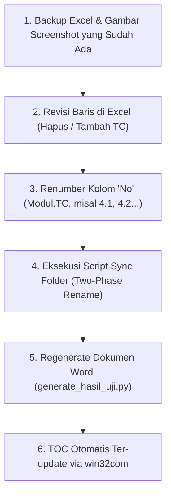

---
tags:
  - SIT
  - UAT
  - BTN
  - QA
  - Python
  - Automation
  - HasilUji
  - SOP
date: 2026-09-21
project: BTN Smart
type: guide
---

# 📘 Panduan Generator & Siklus Hasil Uji BTN Smart

> Dokumentasi best practice penulisan Test Case, arsitektur script generator Word Hasil Uji, serta SOP penanganan perubahan/revisi Test Case di tengah pengujian.

---

## 🎯 1. Prinsip & Standar Test Case BTN

### ❌ Redundansi "Menampilkan Daftar"
Berdasarkan analisis dokumen template baku BTN (`Dokumen_Hasil_Uji_-_UT_Corporate_Banking_CBD.docx`):
- **JANGAN** membuat Test Case terpisah *"Menampilkan daftar data X"* tepat setelah *"Membuka halaman X"*.
- **Alasan:**
  1. **Logika Testing:** Saat tester berhasil membuka halaman, Expected Result sudah mencakup *"Halaman X terbuka dan menampilkan tabel/daftar data"*. Satu screenshot sudah membuktikan keduanya.
  2. **Kerapian Dokumen:** Menghindari 2 tabel berturut-turut di dokumen Word dengan screenshot gambar yang sama persis (mubazir halaman).
  3. **Efisiensi Tester:** Tidak perlu upload 2 file screenshot yang sama ke 2 folder berbeda.
- **Kapan kata "Menampilkan / Melihat" boleh dipakai?**
  - Hanya untuk aksi klik lanjutan (misal: klik tab lain seperti tab *Prospek Closing*, klik aksi *Detail*, melihat *Popup/Modal*, atau *Riwayat Transaksi*).

---

## 🔄 2. SOP Penanganan Perubahan Test Case (Penambahan / Pengurangan)

Di tengah proses SIT/UAT, perubahan jumlah TC (tambah fitur atau pangkas TC redundan) sangat lumrah terjadi. Jangan panik, ikuti SOP berikut:



### Langkah Penting Script Sinkronisasi Folder:
1. **Safety First (Backup):**
   - Selalu salin gambar yang sudah ada (misal di folder `4.1` atau `4.5`) ke direktori backup lokal sementara sebelum memanipulasi folder.
2. **Two-Phase Rename:**
   - Untuk menghindari error tubrukan nama folder saat nomor bergeser (misal folder `4.3` mau di-rename jadi `4.2`, padahal `4.2` masih ada):
     - **Fase 1:** Rename folder lama ke nama temporary: `__tmp_ren_{idx}`.
     - **Fase 2:** Rename temporary ke nama target akhir: `{new_no} {Judul}`.
3. **Pembaruan File `.txt` Panduan:**
   - Tiap folder TC wajib memiliki file `.txt` dengan nama yang sama persis dengan foldernya (`[No] [Judul].txt`) berisi deskripsi, steps, dan expected result terbaru.

---

## 🛠️ 3. Troubleshooting Teknis & Windows Quirks

### A. Windows File Locking (`[WinError 32]`)
* **Penyebab:** Google Drive for Desktop (`GoogleDriveFS.exe`), Windows Defender/Indexer, atau aplikasi teks (seperti `notepad.exe`) sedang membuka file `.txt` di dalam folder tersebut saat script mencoba menghapus/me-rename folder.
* **Solusi:**
  - Pastikan semua editor teks (Notepad, VS Code) dan file browser tidak sedang membuka folder/file yang akan dirombak.
  - Tambahkan fungsi retry berulang (misal 5x retry dengan jeda `time.sleep(0.5)`).

### B. Windows MAX_PATH (> 260 Karakter)
* Beberapa judul Test Case sangat panjang (seperti TC Bulk Upload atau Approval).
* **Solusi Wajib:** Selalu gunakan prefix long path `\\?\` pada sistem operasi Windows melalui helper function:
  ```python
  def make_long_path(p):
      abs_p = os.path.abspath(p)
      if os.name == 'nt' and not abs_p.startswith('\\\\?\\'):
          return '\\\\?\\' + abs_p
      return abs_p
  ```

### C. TOC Word & Double Numbering di Heading
* Dokumen template Word menggunakan template heading bawaan yang memiliki `numPr` (auto-numbering).
* **Solusi:** 
  - Strip elemen `w:numPr` dari Heading 1 saat cloning paragraph di script Python, lalu suntikkan nomor manual (`1. Modul Login`, `2. Modul Profile`) agar tidak terjadi double numbering (seperti `1. 1. Modul Login`).
  - Ubah field code TOC ke `TOC \o "1-3"` agar kompatibel dengan Microsoft Word versi Bahasa Indonesia maupun Bahasa Inggris.

---

## 📂 4. Lokasi Kerja & Backup

| Komponen | Path Utama | Path Backup |
|---|---|---|
| **Eksekusi & Dokumen** | `H:\My Drive\Zegen\BTN Smart\Refactor\` | `d:\Project\BTN\` |
| **Excel Test Case** | `H:\My Drive\Zegen\BTN Smart\Refactor\SIT\Test Case.xlsx` | `d:\Project\BTN\SIT\Test Case.xlsx` |
| **Generator Script** | `H:\My Drive\Zegen\BTN Smart\Refactor\generate_hasil_uji.py` | `d:\Project\BTN\generate_hasil_uji.py` |
| **Screenshot Web** | `H:\My Drive\Zegen\BTN Smart\Refactor\Hasil Uji\Screenshot\Web\` | `d:\Project\BTN\Hasil Uji\Screenshot\Web\` |
| **Dokumen Output Web** | `H:\My Drive\Zegen\BTN Smart\Refactor\Hasil Uji\Dokumen_Hasil_Uji_Web.docx` | `d:\Project\BTN\Hasil Uji\Dokumen_Hasil_Uji_Web.docx` |

---

## 🏛️ 5. Standar Penomoran & Struktur Sub Menu (75 Sub Menu)

Per revisi 21 September 2026:
1. **Heading Dokumen per Sub Menu:**
   - Format heading: `{sec_num}. Modul {mod_name} - {sub_name}` (contoh: `6. Modul User Authority - User`, `10. Modul User Authority - Keamanan Akun`).
2. **Pola Tabel Hasil Uji:**
   - TC pertama pada tiap Sub Menu memiliki tabel 4 baris (header row biru `User Acceptance Testing (UAT)`).
   - TC berikutnya pada Sub Menu yang sama menyambung dengan tabel 3 baris (tanpa header row biru).
3. **Pencarian Screenshot & Urutan File:**
   - Script generator otomatis membaca folder per Sub Menu: `{sec_num:02d}. {sub_label}` dan folder TC: `{no_val} {tc_title}`.
   - Gambar diurutkan secara natural numeric (`1.png`, `2.png`, `3.png`) dan disisipkan dengan ukuran proporsional (lebar 5.9 inci / ~15 cm).

---

## 📑 6. Header, Margin & Sinkronisasi Multi-Drive

1. **Injeksi Header & Margin Template:**
   - Template menggunakan header khusus dengan logo BTN (`image278.jpg`) dan logo ZSM (`image1.png`).
   - Margins dokumen template sangat spesifik (`top=2280`, `right=180`, `bottom=1460`, `left=880`) agar tabel tampil rata tengah dan proporsional.
   - Dilakukan via `post_process_header()` menggunakan manipulasi zipfile **setelah** TOC Word diperbarui (`update_toc()`).
2. **Metode Safe Replacement XML (`sectPr`):**
   - **PERINGATAN:** Jangan gunakan regex `re.sub(r'<w:sectPr.*?')` secara serakah (greedy), karena regex bisa mencocokkan dari tag `sectPr` pertama di cover/halaman awal hingga akhir dokumen dan merusak tag penutup paragraf (`mismatched tag`).
   - **Solusi:** Gunakan `rfind('<w:sectPr')` untuk hanya mengganti `sectPr` paling akhir di ujung body dokumen.
3. **Distribusi / Sinkronisasi Drive:**
   - Dokumen otomatis disinkronkan ke 3 lokasi sekaligus:
     - **Local:** `d:\Project\BTN\Hasil Uji\`
     - **Drive H (Zegen):** `H:\My Drive\Zegen\BTN Smart\Refactor\Hasil Uji\`
     - **Drive G (dainnaxjakarta91):** `G:\My Drive\Zegen\BTN Smart\Refactor\Hasil Uji\`
