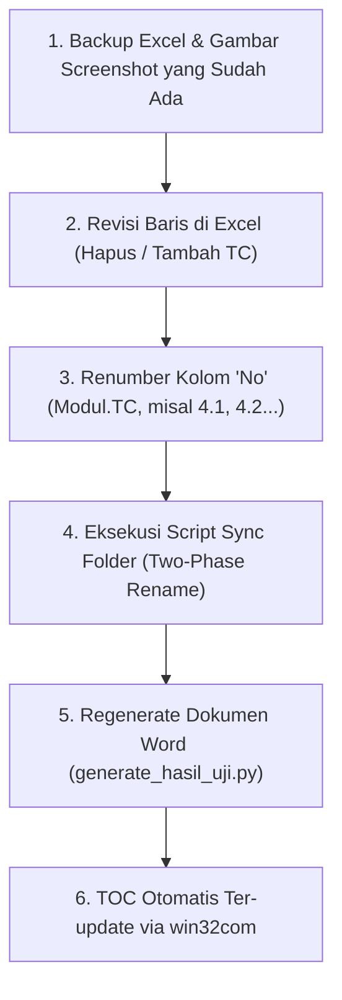
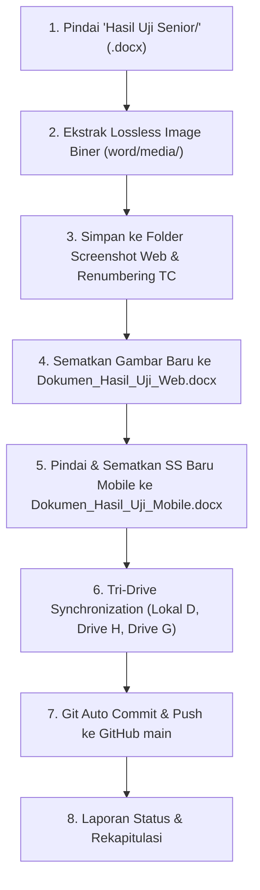

---
tags:
  - SIT
  - UAT
  - BTN
  - QA
  - Python
  - Automation
  - HasilUji
  - SOP
date: 2026-09-21
project: BTN Smart
type: guide
---

# 📘 Panduan Generator & Siklus Hasil Uji BTN Smart

> Dokumentasi best practice penulisan Test Case, arsitektur script generator Word Hasil Uji, serta SOP penanganan perubahan/revisi Test Case di tengah pengujian.

---

## 🎯 1. Prinsip & Standar Test Case BTN

### ❌ Redundansi "Menampilkan Daftar" & "Tab Default"
Berdasarkan analisis dokumen template baku BTN (`Dokumen_Hasil_Uji_-_UT_Corporate_Banking_CBD.docx`):
1. **Daftar Data Otomatis:**
   - **JANGAN** membuat Test Case terpisah *"Menampilkan daftar data X"* tepat setelah *"Membuka halaman X"*.
   - Saat tester berhasil membuka halaman, Expected Result sudah mencakup *"Halaman X terbuka dan menampilkan tabel/daftar data"*. Satu screenshot sudah membuktikan keduanya.
2. **Tab Default / Landing Tab:**
   - **JANGAN** membuat Test Case untuk mengklik tab yang secara *default* sudah aktif/terbuka saat halaman diakses.
   - *Contoh Kasus:* Pada Modul Agenda (Pengingat / Daily Sales), saat halaman dibuka, tab pertama langsung aktif. TC "Melihat tab default" atau "Memilih tab default" tepat setelah membuka halaman adalah redundan (seperti kasus TC 9.2, 14.2, 15.2 yang telah dihapus).
   - TC navigasi tab hanya valid dibuat untuk berpindah ke tab *selain* default (misal tab *Selesai*, *Riwayat*, atau status lain).
- **Kapan kata "Menampilkan / Melihat" boleh dipakai?**
  - Hanya untuk aksi klik lanjutan (misal: klik tab lain seperti tab *Prospek Closing*, klik aksi *Detail*, melihat *Popup/Modal*, atau *Riwayat Transaksi*).

### ⚖️ Pemisahan Dokumen Test Script (Uji Sistem vs Refactor)
- **`Test Script\Uji Sistem.xlsx` (Bank BTN Legacy Reference - IMMUTABLE):**
  - Merupakan file asli/kontrak dari Bank BTN.
  - **DILARANG MENGUBAH / MENGHAPUS / MENAMBAH BARIS** di file ini. File ini harus tetap orisinil sebagai acuan baseline histori proyek dari klien.
- **`Test Script\Test Script BTN Smart Refactor.xlsx` (Working Document QA):**
  - Merupakan file kerja aktif kita.
  - Semua eliminasi TC redundan, restrukturisasi skenario, penambahan TC baru, dan penomoran ulang (*renumbering*) hanya boleh dilakukan di file ini.


---

## 🔄 2. SOP Penanganan Perubahan Test Case (Penambahan / Pengurangan)

> [!CAUTION] 🚨 ATURAN MUTLAK: KONFIRMASI DULU KE USER SEBELUM MODIFIKASI
> Jika saat siklus sinkronisasi / pemeriksaan dokumen ditemukan adanya penambahan atau pengurangan Test Case dari rekan tim / senior (misal di SIT Word, Excel, atau Drive H):
> 1. **DILARANG KERAS** langsung mengubah, menghapus, atau menggeser nomor folder/dokumen secara otomatis/sepihak.
> 2. **WAJIB LAPORKAN & KONFIRMASI TERLEBIH DAHULU** ke Mas Dani (USER):
>    - Sebutkan modul apa dan nomor TC berapa yang bertambah atau berkurang.
>    - Jelaskan detail perubahannya (judul TC, steps, expected result).
>    - Minta persetujuan apakah perubahan tersebut disetujui untuk diadopsi ke `Refactor`.
> 3. Eksekusi restrukturisasi folder, Excel, dan dokumen Word **HANYA** boleh dijalankan setelah Mas Dani memberikan konfirmasi persetujuan.

Di tengah proses SIT/UAT, perubahan jumlah TC (tambah fitur atau pangkas TC redundan) sangat lumrah terjadi. Setelah konfirmasi disetujui, ikuti SOP teknis berikut:


```mermaid
flowchart TD
    A["1. Backup Excel & Gambar Screenshot yang Sudah Ada"] --> B["2. Revisi Baris di Excel (Hapus / Tambah TC)"]
    B --> C["3. Renumber Kolom 'No' (Modul.TC, misal 4.1, 4.2...)"]
    C --> D["4. Eksekusi Script Sync Folder (Two-Phase Rename)"]
    D --> E["5. Regenerate Dokumen Word (generate_hasil_uji.py)"]
    E --> F["6. TOC Otomatis Ter-update via win32com"]
```

### Langkah Penting Script Sinkronisasi Folder:
1. **Safety First (Backup):**
   - Selalu salin gambar yang sudah ada (misal di folder `4.1` atau `4.5`) ke direktori backup lokal sementara sebelum memanipulasi folder.
2. **Two-Phase Rename:**
   - Untuk menghindari error tubrukan nama folder saat nomor bergeser (misal folder `4.3` mau di-rename jadi `4.2`, padahal `4.2` masih ada):
     - **Fase 1:** Rename folder lama ke nama temporary: `__tmp_ren_{idx}`.
     - **Fase 2:** Rename temporary ke nama target akhir: `{new_no} {Judul}`.
3. **Pembaruan File `.txt` Panduan:**
   - Tiap folder TC wajib memiliki file `.txt` dengan nama yang sama persis dengan foldernya (`[No] [Judul].txt`) berisi deskripsi, steps, dan expected result terbaru.

---

## 🛠️ 3. Troubleshooting Teknis & Windows Quirks

### A. Windows File Locking (`[WinError 32]`)
* **Penyebab:** Google Drive for Desktop (`GoogleDriveFS.exe`), Windows Defender/Indexer, atau aplikasi teks (seperti `notepad.exe`) sedang membuka file `.txt` di dalam folder tersebut saat script mencoba menghapus/me-rename folder.
* **Solusi:**
  - Pastikan semua editor teks (Notepad, VS Code) dan file browser tidak sedang membuka folder/file yang akan dirombak.
  - Tambahkan fungsi retry berulang (misal 5x retry dengan jeda `time.sleep(0.5)`).

### B. Windows MAX_PATH (> 260 Karakter)
* Beberapa judul Test Case sangat panjang (seperti TC Bulk Upload atau Approval).
* **Solusi Wajib:** Selalu gunakan prefix long path `\\?\` pada sistem operasi Windows melalui helper function:
  ```python
  def make_long_path(p):
      abs_p = os.path.abspath(p)
      if os.name == 'nt' and not abs_p.startswith('\\\\?\\'):
          return '\\\\?\\' + abs_p
      return abs_p
  ```

### C. TOC Word & Double Numbering di Heading
* Dokumen template Word menggunakan template heading bawaan yang memiliki `numPr` (auto-numbering).
* **Solusi:** 
  - Strip elemen `w:numPr` dari Heading 1 saat cloning paragraph di script Python, lalu suntikkan nomor manual (`1. Modul Login`, `2. Modul Profile`) agar tidak terjadi double numbering (seperti `1. 1. Modul Login`).
  - Ubah field code TOC ke `TOC \o "1-3"` agar kompatibel dengan Microsoft Word versi Bahasa Indonesia maupun Bahasa Inggris.

### D. Normalisasi Ekstensi Gambar & Deteksi Magic Bytes
* **Masalah:** File screenshot yang diunggah tester (baik lewat Google Drive sync, mobile capture, atau chat) kadang kehilangan ekstensi file (misal file bernama `1` atau `2` tanpa `.png`/`.jpg`). Script generator yang hanya membaca pola `*.png` akan melewatkan gambar tersebut atau crash saat `add_picture()`.
* **Solusi:** Script wajib membaca *magic bytes* / signature file biner sebelum menyisipkan gambar:
  - Header `b'\x89PNG\r\n\x1a\n'`: format **PNG**
  - Header `b'\xff\xd8'`: format **JPEG/JPG**
  - Jika file terdeteksi tidak memiliki ekstensi atau berekstensi salah, script otomatis menormalisasi ekstensinya.

### E. Standarisasi Penamaan File Screenshot (Leading Zeros)
* **Masalah:** Penamaan `1.png`, `2.png`, ... `10.png` dapat menyebabkan sorting alfabetik bawaan sistem operasi mengurutkannya menjadi `1.png`, `10.png`, `2.png` (nomor 10 mendahului nomor 2).
* **Solusi:** Standarisasi penamaan menggunakan *leading zero* (`01.png`, `02.png`, ..., `10.png`) atau gunakan sorting *natural numeric key* (`int(re.search(r'\d+', name).group())`) pada script Python agar urutan visual kronologis pengujian tidak tertukar.


---

## 📂 4. Lokasi Kerja & Backup

| Komponen | Path Utama | Path Backup |
|---|---|---|
| **Eksekusi & Dokumen** | `H:\My Drive\Zegen\BTN Smart\Refactor\` | `d:\Project\BTN\` |
| **Excel Test Case** | `H:\My Drive\Zegen\BTN Smart\Refactor\SIT\Test Case.xlsx` | `d:\Project\BTN\SIT\Test Case.xlsx` |
| **Generator Script** | `H:\My Drive\Zegen\BTN Smart\Refactor\generate_hasil_uji.py` | `d:\Project\BTN\generate_hasil_uji.py` |
| **Screenshot Web** | `H:\My Drive\Zegen\BTN Smart\Refactor\Hasil Uji\Screenshot\Web\` | `d:\Project\BTN\Hasil Uji\Screenshot\Web\` |
| **Dokumen Output Web** | `H:\My Drive\Zegen\BTN Smart\Refactor\Hasil Uji\Dokumen_Hasil_Uji_Web.docx` | `d:\Project\BTN\Hasil Uji\Dokumen_Hasil_Uji_Web.docx` |

---

## 🏛️ 5. Standar Penomoran & Struktur Sub Menu (75 Sub Menu)

Per revisi 21 September 2026:
1. **Heading Dokumen per Sub Menu:**
   - Format heading: `{sec_num}. Modul {mod_name} - {sub_name}` (contoh: `6. Modul User Authority - User`, `10. Modul User Authority - Keamanan Akun`).
2. **Pola Tabel Hasil Uji:**
   - TC pertama pada tiap Sub Menu memiliki tabel 4 baris (header row biru `User Acceptance Testing (UAT)`).
   - TC berikutnya pada Sub Menu yang sama menyambung dengan tabel 3 baris (tanpa header row biru).
3. **Pencarian Screenshot & Urutan File:**
   - Script generator otomatis membaca folder per Sub Menu: `{sec_num:02d}. {sub_label}` dan folder TC: `{no_val} {tc_title}`.
   - Gambar diurutkan secara natural numeric (`1.png`, `2.png`, `3.png`) dan disisipkan dengan ukuran proporsional (lebar 5.9 inci / ~15 cm).

---

## 📑 6. Header, Margin & Sinkronisasi Multi-Drive

1. **Injeksi Header & Margin Template:**
   - Template menggunakan header khusus dengan logo BTN (`image278.jpg`) dan logo ZSM (`image1.png`).
   - Margins dokumen template sangat spesifik (`top=2280`, `right=180`, `bottom=1460`, `left=880`) agar tabel tampil rata tengah dan proporsional.
   - Dilakukan via `post_process_header()` menggunakan manipulasi zipfile **setelah** TOC Word diperbarui (`update_toc()`).
2. **Metode Safe Replacement XML (`sectPr`):**
   - **PERINGATAN:** Jangan gunakan regex `re.sub(r'<w:sectPr.*?')` secara serakah (greedy), karena regex bisa mencocokkan dari tag `sectPr` pertama di cover/halaman awal hingga akhir dokumen dan merusak tag penutup paragraf (`mismatched tag`).
   - **Solusi:** Gunakan `rfind('<w:sectPr')` untuk hanya mengganti `sectPr` paling akhir di ujung body dokumen.
3. **Distribusi / Sinkronisasi Drive:**
   - Dokumen otomatis disinkronkan ke 3 lokasi sekaligus:
     - **Local:** `d:\Project\BTN\Hasil Uji\`
     - **Drive H (Zegen):** `H:\My Drive\Zegen\BTN Smart\Refactor\Hasil Uji\`
     - **Drive G (dainnaxjakarta91):** `G:\My Drive\Zegen\BTN Smart\Refactor\Hasil Uji\`

---

## 🎯 7. Pembagian Modul QA (Scope Kerja Mas Dani vs Tim / Senior)

Agar pengujian dan dokumen hasil uji tidak saling tumpang tindih (*conflict*), ruang lingkup modul dibagi secara tegas:

| Platform | Modul Mas Dani (Tanggung Jawab Utama) | Modul Rekan Tim / Senior |
|---|---|---|
| **Web** | 1. **Login** (`01. Login`)<br>2. **Profile - Keamanan** (`02. Profile`)<br>3. **User Authority** (`06` s/d `10`: User, Group Role, Tipe Karyawan, Hak Akses Role, Keamanan Akun)<br>4. **Profile Nasabah & Sales** (`11` Sales, `12` Nasabah Perorangan)<br>5. **Menu Absent** (`32` s/d `35`: Dashboard, Daily, Approval, Rekap Absent)<br>6. **Setting Absent** (`40` s/d `42`: Attendance Spot, Work Pattern, Holiday)<br>7. **Report Funding** (`60` s/d `64`: Daily Sales, Personal, Rekap, Regional, Pengaturan Funnel)<br>8. **Report Lending** (`65` s/d `69`: Daily Sales, Personal, Rekap, Regional, Pengaturan Funnel) | **Sales Force** (Sales Code, Pipeline, CIF Kelolaan, CIF Rebase, Produktivitas, Dashboard Sales Force), **Lead Generation & Qualification**, **Bisnis dan Produk**, **Kantor**, **Upload Bulk**, **Export Data Management**, **Re-Assign & Approval**. |
| **Mobile** | 1. **Profile Nasabah & Sales**<br>2. **Menu Absent** (Dashboard, Daily, Approval, Rekap Absent)<br>3. **Setting Absent** (Attendance Spot, Work Pattern, Holiday) | Modul fitur mobile lainnya milik tim. |

> **Prinsip Kepemilikan Dokumen:**
> Dokumen kerja aktif Mas Dani adalah `Dokumen_Hasil_Uji_Web.docx` dan `Dokumen_Hasil_Uji_Mobile.docx`. Screenshot dari modul milik rekan tim ditarik dan disematkan sebagai pelengkap dokumen master, bukan menggantikan area kerja masing-masing.

---

## ⚡ 8. Protokol Otomasi `"cek sync"` & Integrasi Dokumen Senior

Keyword **`cek sync`** (atau variasi *"sync"*, *"tolong sync ya"*) merupakan trigger perintah cepat otomatis untuk mengeksekusi siklus sinkronisasi end-to-end:

### A. Alur Kerja Otomatis Saat `"cek sync"` Dijalankan:

```mermaid
flowchart TD
    A["1. Pindai 'Hasil Uji Senior/' (.docx)"] --> B["2. Ekstrak Lossless Image Biner (word/media/)"]
    B --> C["3. Simpan ke Folder Screenshot Web & Renumbering TC"]
    C --> D["4. Sematkan Gambar Baru ke Dokumen_Hasil_Uji_Web.docx"]
    D --> E["5. Pindai & Sematkan SS Baru Mobile ke Dokumen_Hasil_Uji_Mobile.docx"]
    E --> F["6. Tri-Drive Synchronization (Lokal D, Drive H, Drive G)"]
    F --> G["7. Git Auto Commit & Push ke GitHub main"]
    G --> H["8. Laporan Status & Rekapitulasi"]
```

### B. Aturan Penarikan Gambar Senior (Lossless OpenXML Extraction):
1. **Format File Senior:**
   - Rekan tim/senior meletakkan salinan file `.docx` di folder `Hasil Uji\Hasil Uji Senior\Dokumen Hasil Uji_UT Upgrade Server Web .docx`.
   - Jika sumber dari Google Docs online (`.gdoc`), wajib di-download via **File → Download → Microsoft Word (.docx)** agar biner gambar tetap tersimpan di dalam file.
2. **Kualitas Gambar Real (Tanpa Kompresi):**
   - Penarikan gambar dilakukan langsung dari part biner `word/media/` OpenXML via Python `doc.part.related_parts[rId].blob`.
   - **DILARANG** melakukan re-encode atau resize gambar via library image editor untuk menjaga ketajaman piksel asli 1:1.
3. **Penyelarasan & Verifikasi Perubahan Test Case (Wajib Konfirmasi):**
   - Jika terdeteksi adanya penambahan, pengurangan, atau pergeseran nomor TC antara dokumen lokal dan dokumen/SIT senior: **JANGAN LANGSUNG EKSEKUSI**.
   - Laporkan detail perubahannya terlebih dahulu ke Mas Dani (nomor TC, judul skenario, modul terkait).
   - Setelah mendapat persetujuan ("Proceed" / "Lanjut"), baru gunakan metode **Two-Phase Rename** untuk menyelaraskan nama folder, mengupdate baris Excel, dan menyusun penomoran tabel di Word.

### C. Tri-Drive Synchronization & Version Control:
- Setiap kali sinkronisasi berhasil, perubahan disalin serentak ke 3 lokasi:
  - `D:\Project\BTN Smart\Refactor\`
  - `H:\My Drive\Zegen\BTN Smart\Refactor\`
  - `G:\My Drive\Zegen\BTN Smart\Refactor\`
- Git commit otomatis dijalankan dengan pesan deskriptif dan dipush ke branch `main`.

### D. Snapshot Modul yang Selesai & Tertanam 100% (Status Per 30 Sep 2026):
- **Web (Dokumen_Hasil_Uji_Web.docx)**:
  - `01. Login`: 16 TC (27 SS) — *Lengkap*
  - `06. User Authority - User`: 9 TC (17 SS) — *Lengkap*
  - `07. User Authority - Group Role`: 9 TC (16 SS) — *Lengkap* (7.1 s/d 7.9)
  - `08. User Authority - Tipe Karyawan`: 8 TC (15 SS) — *Lengkap* (8.1 s/d 8.8)
  - `09. User Authority - Hak Akses Role`: 7 TC (9 SS) — *Lengkap* (9.1 s/d 9.7)
  - `10. User Authority - Keamanan Akun`: 4 TC (4 SS) — (10.1 s/d 10.4)
  - `43. Sales Force - Sales Code`: 4 TC (7 SS) — *TC 43.1 s/d 43.4 ditarik dari doc senior*
  - **Total Web**: **57 TC** (**95 tangkapan layar**) terisi rapi tanpa missing.
- **Mobile (Dokumen_Hasil_Uji_Mobile.docx)**:
  - `02. Profile`: 39 TC (106 SS) — *Lengkap 100%* (TC 2.1 s/d 2.39)
  - `11. Prospek & Nasabah - Input Prospek`: 17 TC (27 SS) — (11.1 s/d 11.5, 11.7 s/d 11.19)
  - `17. Sales Force - Dashboard Sales Code`: 7 TC (15 SS) — *Lengkap 100%* (17.1 s/d 17.7)
  - Modul lainnya: 01 (12 TC), 03 (2 TC), 04 (1 TC), 05 (2 TC), 06 (7 TC), 07 (5 TC), 08 (14 TC), 09 (8 TC), 10 (1 TC), 14 (5 TC), 15 (7 TC).
  - **Total Mobile**: **126 TC** (**277 tangkapan layar**) terisi rapi tanpa missing.

> **Catatan Penting Salinan Dokumen Senior:**
> File salinan di Google Drive yang berekstensi `.gdoc` (online Google Docs) berukuran ~187 bytes adalah shortcut cloud yang tidak menyimpan part biner gambar lokal. Untuk mengekstrak gambar dan tabel secara lossless, dokumen wajib diunduh via **File → Download → Microsoft Word (.docx)** dan ditaruh di folder `Hasil Uji Ka Fuje`.


---

## ?? 9. Aturan Potong Screenshot Web (Web Crop Rules)

Disepakati pada: 5 Oktober 2026

Aturan ini digunakan sebagai standar untuk mengklasifikasi dan memotong gambar UI Web agar bukti hasil uji tetap utuh konteksnya.

1. **Halaman Awal (Screenshot .1, misal 33.1.png)**
   - **Tindakan:** FULL SCREEN (Tidak ada yang dipotong).
   - **Alasan:** Sebagai penanda menu utama yang sedang diakses.
2. **Ada Notifikasi (Alert di Kanan Atas)**
   - **Tindakan:** Hapus Sidebar saja. Navbar TETAP ADA.
   - **Alasan:** Agar pesan pop-up notifikasi tidak ikut terpotong.
3. **Drawer / Filter dari Samping Kanan**
   - **Tindakan:** Hapus Sidebar saja. Navbar TETAP ADA.
   - **Alasan:** Menjaga struktur visual dari drawer sisi kanan.
4. **Drawer dari Bawah**
   - **Tindakan:** Hapus Navbar saja. Sidebar TETAP ADA.
   - **Alasan:** Drawer bawah memanjang horizontal, butuh sidebar sebagai penyeimbang layout.
5. **Sidebar Diperkecil (Minimized)**
   - **Tindakan:** Bisa ikut dihapus (~80px) selama tidak melanggar aturan 1-4.
6. **Kondisi A: Pop-up / Modal di Tengah Layar**
   - **Tindakan:** Bisa Hapus Sidebar saja, atau Hapus Sidebar & Navbar (Full Body Crop) jika aman.
   - **Alasan:** Menjaga posisi pop-up agar tidak terlihat aneh.
7. **Kondisi B: Default / Halaman Tabel Normal (Tidak ada drawer/notif)**
   - **Tindakan:** Hapus Sidebar & Navbar (Full Body Crop).
   - **Alasan:** Agar area tabel/data bisa ter-zoom maksimal saat diletakkan di Word.

> [!CAUTION] ?? ATURAN MUTLAK KETIKA RAGU
> Jika script AI bingung atau ragu dalam mengklasifikasikan gambar tertentu (misal UI tumpang tindih atau tidak biasa), **DILARANG LANGSUNG MEMOTONG**. AI wajib memberikan **Report Klasifikasi / List Gambar** dan meminta **ACC** ke Mas Dani (USER) terlebih dahulu sebelum eksekusi pemotongan dilakukan.
